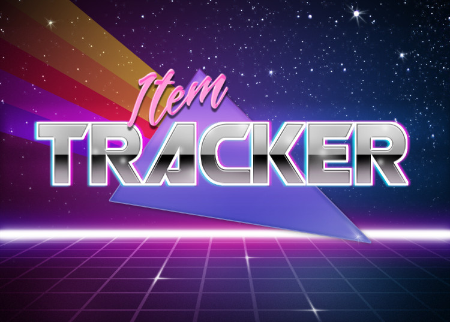
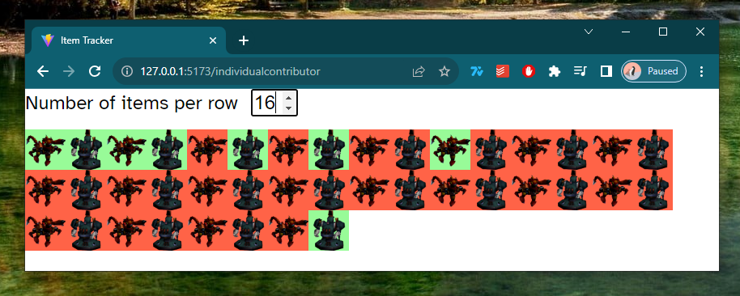
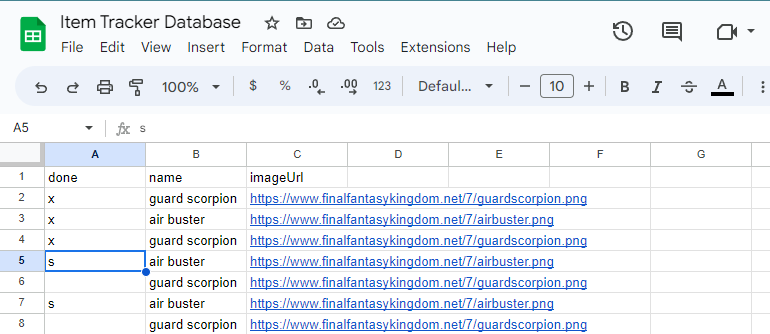

## How do I use this?

How to use this thing:
<ol>
  <li>Open the Google Sheet database using [this link](https://docs.google.com/spreadsheets/d/1_WhFuaqwixhp0ya8oOV_ECFGj1QhdQtukZq3P_VjYO8/edit?usp=sharing)</li>
  <li>
    Add a new sheet, or duplicate an existing one, and name it. The name you pick will be the page URL,
    e.g. <strong>itemtracker.surge.sh/#/Sheet1</strong>
  </li>
  <li>
    Add item names and image URLs to have them display on your page. Row order determines where your
    image will be displayed in the grid
  </li>
  <li>Put any value in the "done" column to change the item background from red to green</li>
  <li>
    After creating your new sheet in the database refresh the browser on the homepage to see a link to
    your new page
  </li>
</ol>
 

  <i>
    Your page will update every ~10 seconds, so once you've updated the "done" column on your sheet it
    will take ~10 seconds to see the item image background trun from red to green, or vice versa.
  </i>

## Webpage

## Sheets (database)

The webpage uses a Google Sheet as a backend

Link to Google Sheet https://docs.google.com/spreadsheets/d/1_WhFuaqwixhp0ya8oOV_ECFGj1QhdQtukZq3P_VjYO8/edit?usp=sharing

Insert any value, e.g. `x`, into the `done` column to turn that image from red to green on the webpage

To add new items to the database put in a `name` and `image` link, the webpage will automatically display the new item
